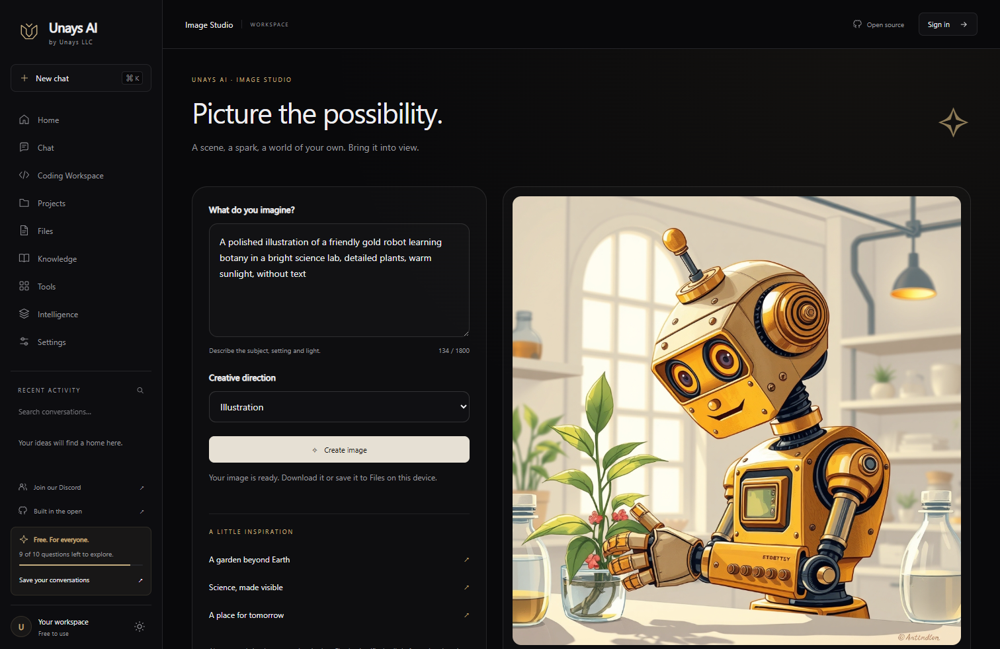

# Unays AI

**Open. Intelligent. Built for everyone.**

An open-source AI workspace by [Unays LLC](https://unays.net). Think, learn, create images, organize knowledge, and build real browser projects in one black-and-gold interface.

[Use Unays AI](https://unays.net/ai/) · [Join our Discord](https://discord.gg/fSvV8vqzA) · [Report an issue](https://github.com/UnaysLLC/unays-ai/issues)



## What is here

This is the first community release of the actual Unays AI interface and reusable AI gateways, with a small, independently runnable Node.js server. It is not a dump of our production infrastructure or account database.

- Streaming conversations, automatic task routing, linked web research, and reviewed learning hints.
- A multi-file coding workspace, syntax highlighting, editable files, local revisions, ZIP export, sandboxed browser previews, and expiring preview links.
- Image generation with creative styles, variations, JPEG download, and saving to your browser's Files library.
- Local files, notes, collections, project dashboards, dark/light appearance, and responsive desktop, iPad and phone layouts.
- A private image-service Worker. Provider credentials remain on the server.
- Tests for key rotation, interrupted streams, guest accounting, image failures, origin checks, and protected file serving.

The community starter supports one owner account and personal saved conversations. The hosted service also provides multi-user teams, Google sign-in, profile management, document extraction and isolated server-side language execution. Those production integrations are **not included** in this starter. Browser HTML/CSS/JavaScript previews work without a program-execution service. Community integration work is welcome.

The code is MIT licensed. The product has no pricing, subscriptions, checkout or upgrade flow. Self-hosting uses your own server and AI-service accounts; those services may have their own usage limits or costs.

## Run locally

Install Node.js 22 or newer, then:

```sh
git clone https://github.com/UnaysLLC/unays-ai.git
cd unays-ai
npm ci
cp .env.example .env
```

On PowerShell, use `Copy-Item .env.example .env` and `npm.cmd` if script execution policy blocks `npm`.

Edit `.env` to configure your own conversation and coding credentials. Use a unique owner password of at least 16 characters. The frontend can be explored without credentials, but AI requests need a configured service.

```sh
npm start
```

Open **http://localhost:3088/ai/**. The default bind address is loopback. Do not expose the starter directly to the internet. Follow [deployment guidance](docs/SELF_HOSTING.md) for HTTPS, private configuration, reverse proxying and access control.

Guests share ten successful chat/image requests per persistent browser token. Signing in to the owner account removes the guest limit while normal rate and shared-capacity limits remain. Sessions expire after 12 hours and on server restart. The personal library stays in browser IndexedDB. Owner conversations are stored under `data/`; back up and protect that directory.

## Enable images

Deploy `worker/image-worker.mjs` using the included example configuration, an AI binding, and a randomly generated `ORIGIN_SECRET` secret. Set `IMAGE_SERVICE_URL` to your Worker's `/generate` endpoint and `IMAGE_SERVICE_SECRET` to the same secret in the server's private environment. See [self-hosting](docs/SELF_HOSTING.md). The browser never receives that secret.

Images are generated on demand; this repository does not substitute sample pictures for successful responses. A failed or malformed image response does not consume a guest question. The default shared image budget is 100 completed images per UTC day, with two simultaneous jobs and separate user/IP rate limits.

## Coding behavior

The coding gateway uses the designated coding model through the configured service only. It silently advances to the next configured key after quota exhaustion, preserves partial output when continuing interrupted streams, and never substitutes an unrelated model. A shared origin challenge pauses that provider briefly rather than retrying every key. Service identifiers exist in server configuration and source; the interface displays Unays AI.

## Development

```sh
npm test
npm run check
```

No frontend build step or runtime npm dependencies are required. Browser libraries are vendored with their license notices. See [THIRD_PARTY_NOTICES.md](THIRD_PARTY_NOTICES.md).

`public/ai/` contains the interface; `src/` contains reusable gateways; `server.mjs` is the community adapter; `worker/` contains the image bridge; `test/` contains deterministic tests. AI-service requests are mocked in automated tests, so running the test suite does not spend API credits.

Read [CONTRIBUTING.md](CONTRIBUTING.md) to help. For private security reports, use [SECURITY.md](SECURITY.md). Please never put credentials, student information, private prompts, or production databases in issues or pull requests.

Unays LLC builds educational services. Unays AI is free to use, open by design, and made with the community.
